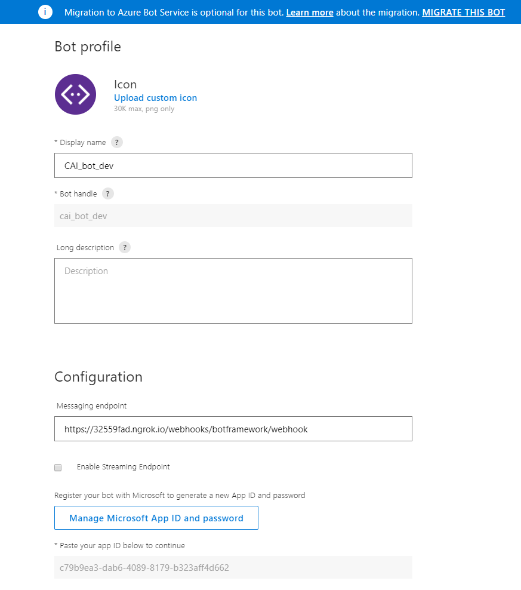
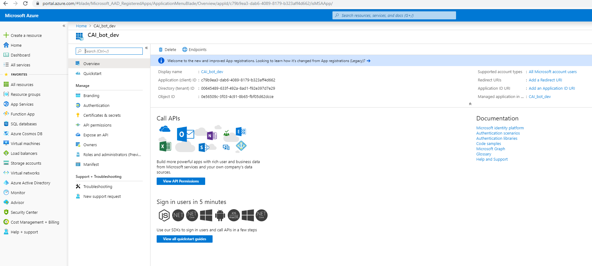

# AVA
---


## Project repo for "Yu et al., AVA: A Financial Service Chatbot based on Deep BidirectionalTransformer, submitted for peer review" 

Welcome!

## Table of Contents

- [Additional Results for the Main Paper](#additional-results-for-the-main-paper)
  - [Histogram of Uncertainties by Dropout Ratios](#histogram-of-uncertainties-by-dropout-ratios)
  - [Uncertainty and Accuracy Curves by Dropout Ratios 5-class vs 381-class](#uncertainty-and-accuracy-curves-by-dropout-ratios-5-class-vs-381-class)
  - [Grid Search for Optimal Threshold on Dropout](#grid-search-for-optimal-threshold-on-dropout)  
  - [Optimal Threshold Learning on Dropout 381 classes vs 5 classes](#optimal-threshold-learning-on-dropout-381-classes-vs-5-classes)  

- [BERT Model Scripts](#bert-model-scripts)
  - [Preprocessing of data](#preprocessing-of-data)
  - [Bert Embeddings Model Pretraining](#bert-embeddings-model-pretraining)
  - [Bert model training and exporting](#bert-model-training-and-exporting)
  - [Model Serving API Script](#model-serving-api-script)
  - [Model Inference with Dropout Sampling](#model-inference-with-dropout-sampling)
  - [Visualization of Model Accuracy and Uncertainty](#visualization-of-model-accuracy-and-uncertainty)
  
- [Threshold Optimization Scripts](#threshold-optimization-scripts)

- [Sentence Completion Model Scripts](#sentence-completion-model-scripts)
- [RASA scripts for chatbot](#rasa-scripts-for-chatbot)
- [Microsoft Teams Setup](#microsoft-teams-setup)
  - [Create a bot for MS Teams](#create-a-bot-for-ms-teams)
  - [Change at RASA dialogue_model.py and credentials.py](#change-at-rasa-dialogue-model.py-and-credentials.py)
  - [Start the rasa server](#start-the-rasa-server)
- [License](#license)
- [Contributors](#contributors)

## Additional Results for the Main Paper

##### Histogram of Uncertainties by Dropout Ratios
We list out two columns, nine rows of histograms visualizing difference of three distributions (training, test, irrelevant questions).  The left column shows models trained for 10 epochs and the right are models trained for 30 epochs. From 1st row to 9th row we show distributions obtained from dropout at 10, 20, 30, ..., 90 percent.  

 
 
 
 
 
 
 
 
 

##### Uncertainty and Accuracy Curves by Dropout Ratios 5-class vs 381-class
The 5-class model is trained using the same dataset mentioned in the main paper, but only using Tier-1 classes. 

Uncertainty and Accuracy curves obtained on 381-class model. <br/>
    
<br/>

Uncertainty and Accuracy curves obtained on 5-class model.
<br/>


##### Grid Search For Optimal Threshold on Dropout
Left side is grid search for 381-class problem.  Right side is grid search for 5-class problem.
  

##### Optimal Threshold Learning on Dropout 381 classes vs 5 classes

We compared optimal threshold learning results between 381-class and 5-class problem. As shown in the figures below, because of the large amount of constraints in 381-class problem, optimization process is able to learn stable thresholds when only 100 irrelevant samples are involved.  But for 5-class problem, it starts to stablize when 1000 samples are included.  Also, 381-class learning is very time consuming, which needs several hours to 1 day to finish.  5-class problem can be solved efficiently in several minutes.  These give us some insights to build a hierarchical classifier to filter out irrelevant samples using data representing large clusters of intents before classifying them to exact intents. 


<br/>


## Bert Model Scripts
##### Preprocessing of data
To protect proprietary intellectual property, we cannot share the original data set we used in the main paper. Here, we use a public data set from Larson et al., An Evaluation Dataset for Intent Classification and Out-of-Scope Prediction, EMNLP-IJCNLP 2019.
The complete data set can be download at https://github.com/clinc/oos-eval
The preprocessing jupyter notebook is at alternative_data/data_preprocessing.ipynb. This notebook assumes 

##### Bert Embeddings Model Pretraining
We followed Denis Antyukhov's blog <a href='https://towardsdatascience.com/pre-training-bert-from-scratch-with-cloud-tpu-6e2f71028379'>Pre-training BERT from scratch with cloud TPU</a>. The jupyter notebook is at scripts/notebooks/BERT_PRETRAIN_Ava.ipynb 

##### Bert model training and exporting
The notebook we use for model training, validation, and exporting is at scripts/notebooks/BERT_PRETRAIN_Ava.ipynb  We use a tweaked version of BERT in all our experiments.  

##### Model Serving API Script
Exported BERT model can be served using the script in scripts/notebooks/inmemory_intent.ipynb

##### Model Inference with Dropout Sampling
The complete script for model serving with Monte Carlo Dropout applied on Training, Test, Irrelevant data sets is at scripts/notebooks/dropout_iterate.py.  To change the dropout ratio, you need to change the global variable DROP_RATE in bert/modeling.py, and bert/run_classifier_inmem_noexport.py.
Also, you need to change the dropout rate in your embeddings' bert_config.json file. 

##### Visualization of Model Accuracy and Uncertainty
Once you obtained results from the dropout sampling script, using scripts/BERT_dropout_visualization.ipynb to generate the histogram and accuracy curve shown in the main paper. 

## Sentence Completion Model Scripts

Since we use HuggingFace/Transformer v2.1.1, we use the following script to convert pre-trained Tensorflow based embeddings to Pytorch format.

```
python convert_bert_original_tf_checkpoint_to_pytorch.py \ 
       --tf_checkpoint_path="/mnt/uncased_L-12_H-768_A-12/bert_model.ckpt" \ 
       --bert_config_file="/mnt/uncased_L-12_H-768_A-12/bert_config.json"  \
       --pytorch_dump_path="/mnt/uncased_L-12_H-768_A-12/pytorch_model.bin"
```

New transformer version has a new command transformers-cli (https://huggingface.co/transformers/converting_tensorflow_models.html) to perform the same convert. 

Sentence completion script is at /scripts/sentencompletion/sentence_completion.py. First, initialize the class using

```
bertlm = bert_lm('/mnt/uncased_L-12_H-768_A-12/')  
```

and the main function is 
```
test(intext, beamsize=10,  voclist=None, rule=None)
```

Input parameters are:

* intext
    * The input sentence can be noisy (containing misspelled words) that require auto-correction. As shown in the example, the input sentence has some misspelled words.
    * Alternatively, it can also be a masked sentence, in the form of “Does it require [MASK] signature for IRA signup”.  [MASK] indicates the word needs to be predicted. In this case, the predicted words will not be matched back to input words.  Every MASKED word will have a separate output of top M predict words.  But the main output of the completed sentence is still one (because it can be combined with misspelled words and cause a large search) .
    * Alternatively, the sentence can be a complete sentence, which only needs to be evaluated only for Perplexity score.  Notice the score is for the entire sentence.  The lower the score, the more usual the sentence is.
* Beamsize: This determines how many alternative choices the model needs to explore to complete the sentence. We have three versions of functions, predict\_oov\_v1, predict\_oov\_v2 and predict\_oov\_v3. When there are multiple [MASK] signs in a sentence, and beamsize is larger than 100, v3 function is used as independent correction of multiple OOVs. If beamsize is smaller than 100, v2 is used as joint-probability based correction.  If a sentence has only one [MASK] sign, v1 (Algorithm 2 in Appendix) is used.
* Customized Vocabulary: The default vocabulary is the encoding vocabulary when the bidirectional language model was trained.  Any words in the sentence that do not occur in vocabulary will be treated as OOV, and will be predicted and matched.   If you want to avoid predicting unwanted words, you can include them in the customized vocabulary.  For multiple words, combine them with “|” and the algorithm will split them into list. It is possible to turn off this customized vocabulary during runtime, which simply just put None in the parameters.
* Ignore rule: Sometimes we expect the model to ignore a range of words belonging to specific patterns, for example, all words that are capitalized, all words that start with numbers.   They can be specified as ignore rules using regular expressions to skip processing them as OOV words.  For example,  expression "[A-Z]+" tells the model to ignore all uppercase words, so it will not treat `IRA' as an OOV even it is not in the embeddings vocabulary (because the embeddings are lowercased).  To turn this function off, use None as the parameter.

Return values are:
The model returns two values: the completed sentence, and its perplexity score.


## RASA scripts for chatbot

The chatbot project files are under intentbot folder. 
In actions.py file, we reuse the function in model serving script and call this in run funciton.


```buildoutcfg
    def run(self, dispatcher, tracker, domain):
        question = (tracker.latest_message)['text']
        result = self.predict_inmem(self.session, FLAGS, self.tokenizer, question)
        label = np.argmax(result)
        entropy = -np.sum(np.multiply(result, np.log(result)))
        if entropy <1.5:
            message = 'Your intent classification is '  + str(self.label2_text[label]) + ' num ' + str(label) +' and Entropy is ' + str(entropy)
        else:
            message = 'Sorry I do not know the answer. Entropy is '+ str(entropy)
        dispatcher.utter_message(message)
```

To start this endpoint, run this command in terminal:
```buildoutcfg
python -m rasa_sdk.endpoint --actions actions
```

The other important file of RASA chatbot is dialogue_model.py, where some important lines are changed from the default settings:
```buildoutcfg
import logging
from rasa_core import config
from rasa_core import utils
from rasa_core.channels.botframework import BotFrameworkInput
from rasa_core.agent import Agent
from rasa_core.interpreter import RasaNLUInterpreter
from rasa_core.utils import EndpointConfig
#from rasa_core.channels.slack import SlackInput


logfile = 'dialogue_model.log'


def train_core(domain_file, model_path, training_data_file, policy_config):
    logging.basicConfig(filename=logfile, level=logging.DEBUG)
    agent = Agent(domain_file, policies=config.load(policy_config))
    training_data = agent.load_data(training_data_file)
    agent.train(training_data)
    agent.persist(model_path)
    return agent


def run_core(core_model_path, nlu_model_path, action_endpoint_url):
    logging.basicConfig(filename=logfile, level=logging.DEBUG)
    nlu_interpreter = RasaNLUInterpreter(nlu_model_path)
    action_endpoint = EndpointConfig(url=action_endpoint_url)
    agent = Agent.load(core_model_path, interpreter=nlu_interpreter, action_endpoint=action_endpoint)
    input_channel = BotFrameworkInput(app_id='c79b9ea3-dab6-4089-8179-b323aff4d662', app_password='YLs33Y=0[/r8b:X@03HBA8.Pi4ziWA1]')
    agent.handle_channels([input_channel], 5005, serve_forever=True)

    print("Your bot is ready to talk! Type your messages here or send 'stop'")
    while True:
        a = input()
        if a == 'stop':
            break
        responses = agent.handle_text(a)
        for response in responses:
            print(response["text"])
    return agent
    
if __name__ == '__main__':
    actionConfig = utils.read_yaml_file('endpoints.yml')
    slackConfig = utils.read_yaml_file('credentials.yml')
    train_core('domain.yml', './models/dialogue', './data/stories.md', 'policy.yml')
    run_core('./models/dialogue', './models/current/nlu',
             actionConfig["action_endpoint"]["url"])
    

```

To let RASA communicate to the bot frond-end deployed on MS Teams, we need to import BotFrameworkInput from rasa_core.channels. Also, when initialize BotFrameworkInput channel,
we need to provide app_id and app_password, which are confiugred during Botframework and Azure Directory setup.

To host this dialogue model, run the following command in terminal:
```buildoutcfg
rasa shell
``` 

## Microsoft Teams Setup
##### Create a bot for MS Teams
Create the bot using this link: https://dev.botframework.com/bots/new. ld be able to login. 
Once login, create a bot by filling the profile:
* Message Endpoint: this needs to be RASA endpoint, since I use ngrok on my home computer running RASA server, ngrok mapped my RASA localhost:5005 to that unique URL.    For botframework connection, one has to specify  botframework/webhook <br/> 
  

* Click on "Manage Microsoft App ID and password" to register this bot on Azure.  The Application ID is the App ID to be registered in RASA credentials.yml file.
* When registering, make sure to select account type as "Accounts in any organizational directory (Any Azure AD directory - Multitenant) and personal Microsoft accounts (e.g. Skype, Xbox)", this is very important, if this is not setup correctly, MS Teams bot will not be able to talk to RASA.
* Click on "Certificates and secretes" to new a client secrete to generate a app password (only can be shown once).
 
  
## License

[](/LICENSE)

Released 2020 by [Shi Yu](https://github.com/cyberyu) 
