# AVA
---

## Project repo for "Yu et al., AVA: A Financial Service Chatbot based on Deep BidirectionalTransformer, submitted to ACM KDD 2020" 

Welcome!

## Table of Contents

- [Additional Results for the Main Paper](#additional-results-for-the-main-paper)
  - [Histogram of Uncertainties by Dropout Ratios](#histogram-of-uncertainties-by-dropout-ratios)
  - [Uncertainty and Accuracy Curves by Dropout Ratios 5-class vs 381-class](#uncertainty-and-accuracy-curves-by-dropout-ratios-5-class-vs-381-class)
  - [Grid Search for Optimal Threshold on Dropout](#grid-search-for-optimal-threshold-on-dropout)  
  - [Optimal Threshold Learning on Dropout 381 classes](#optimal-threshold-learning-on-dropout-381-classes)  

- [BERT Model Scripts](#bert-model-scripts)
  
- [Threshold Optimization Scripts](#threshold-optimization-scripts)

- [Sentence Completion Model Scripts](#sentence-completion-model-scripts)
- [RASA scripts for chatbot](#rasa-scripts-for-chatbot)
- [License](#license)
- [Contributors](#contributors)

## Additional Results for the Main Paper

##### Histogram of Uncertainties by Dropout Ratios
We list out two columns, nine rows of histograms visualizing difference of three distributions (training, test, irrelevant questions).  The left column shows models trained for 10 epochs and the right are models trained for 30 epochs. From 1st row to 9th row we show distributions obtained from dropout at 10, 20, 30, ..., 90 percent.  

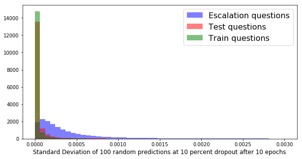 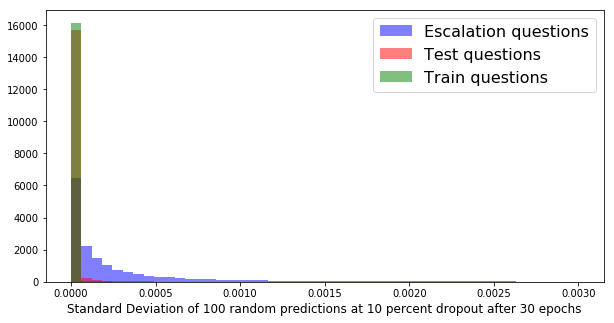
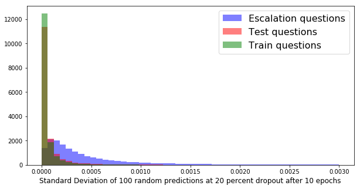 
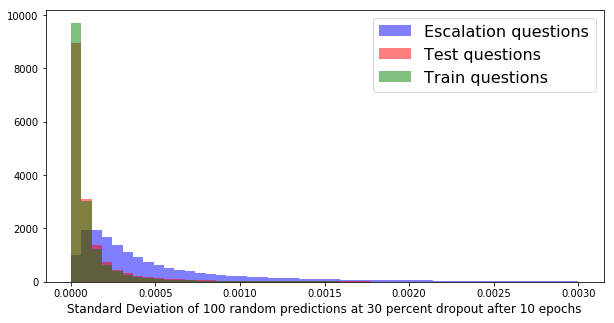 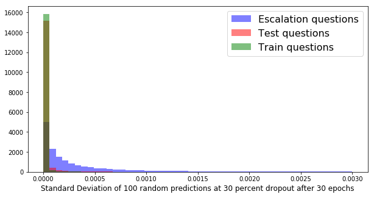
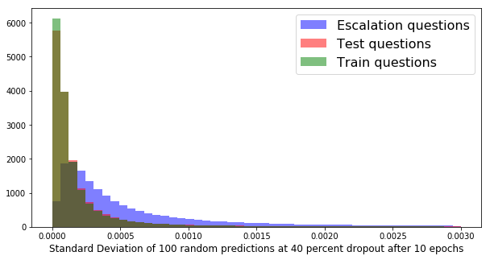 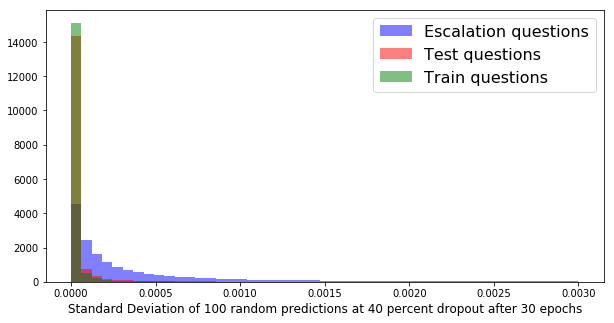
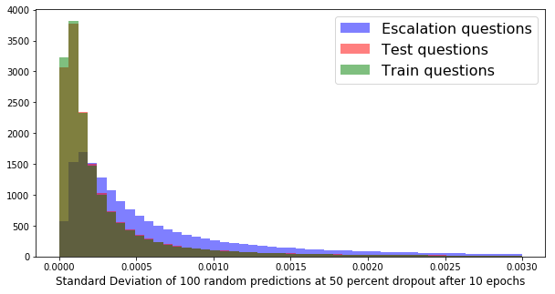 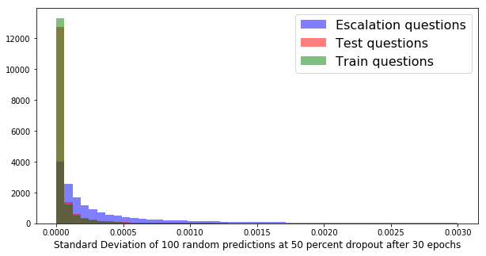
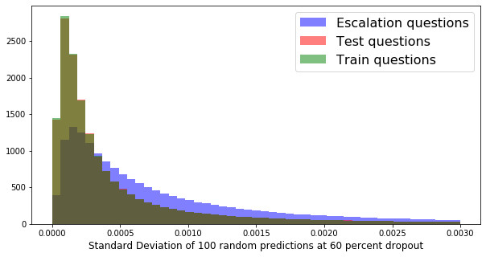 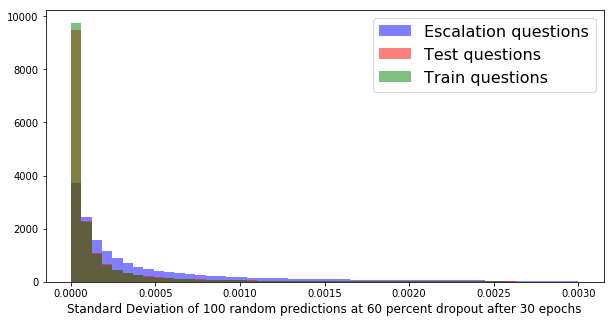
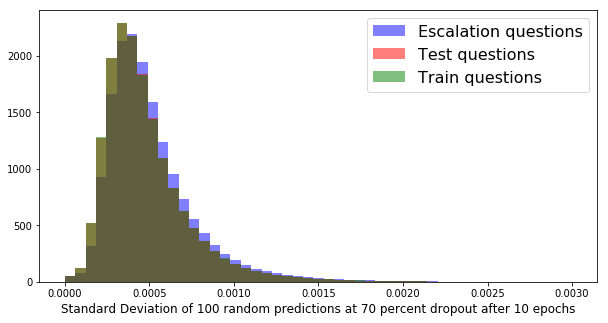 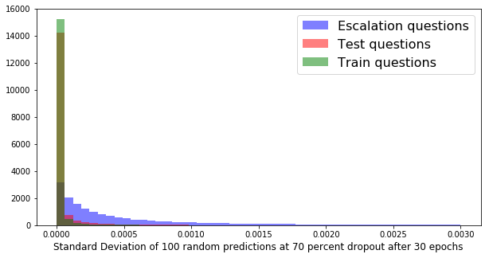
 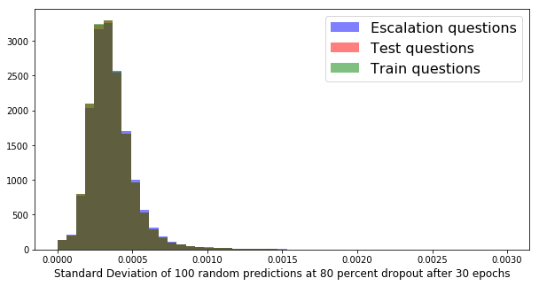
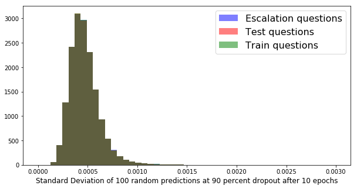 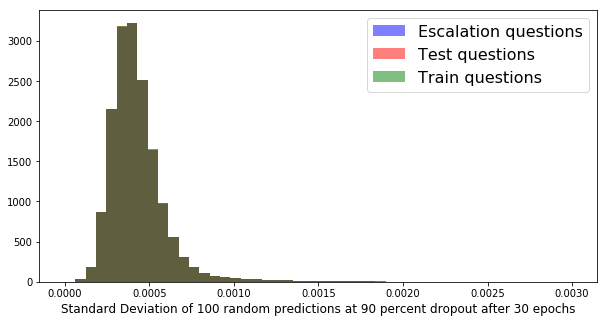

##### Uncertainty and Accuracy Curves by Dropout Ratios 5-class vs 381-class
The 5-class model is trained using the same dataset mentioned in the main paper, but only using Tier-1 classes. 

Uncertainty and Accuracy curves obtained on 381-class model.  
  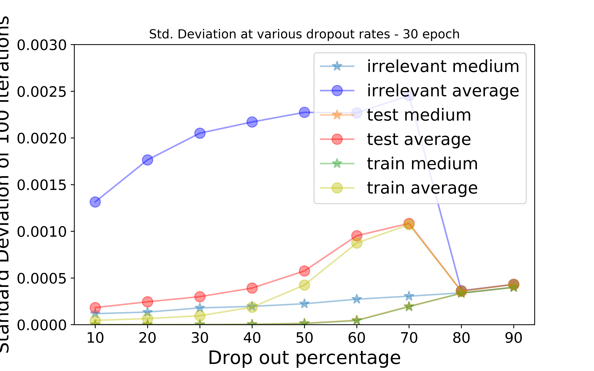  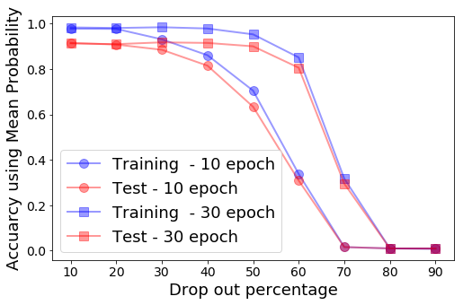
 

Uncertainty and Accuracy curves obtained on 5-class model.
 
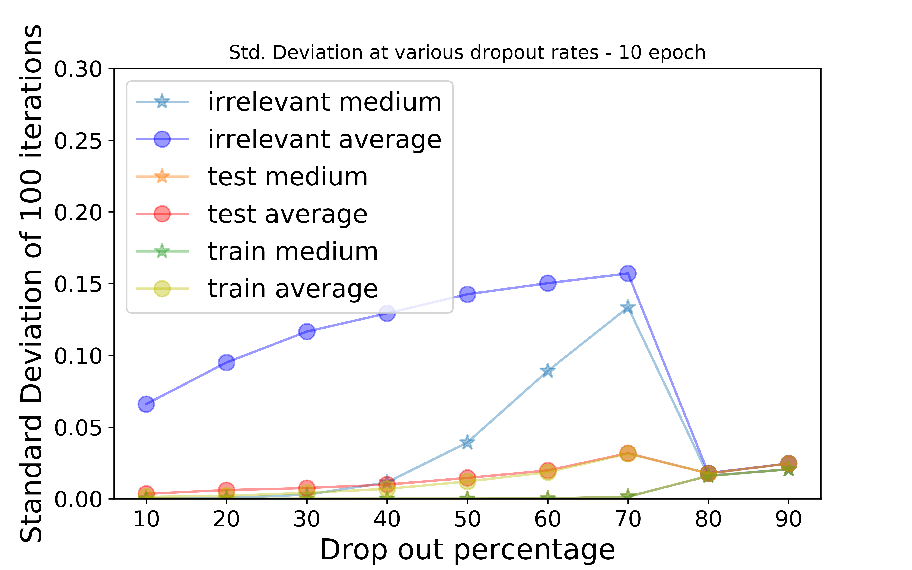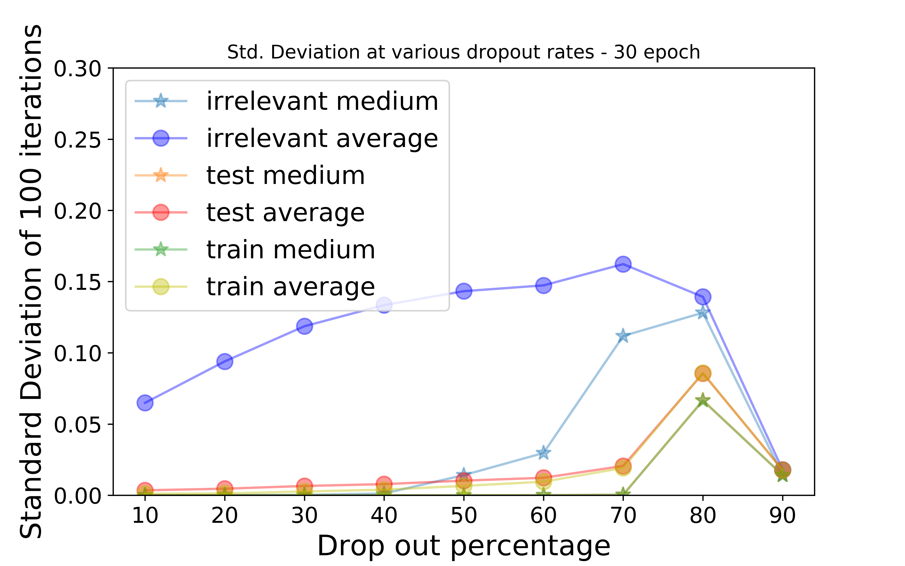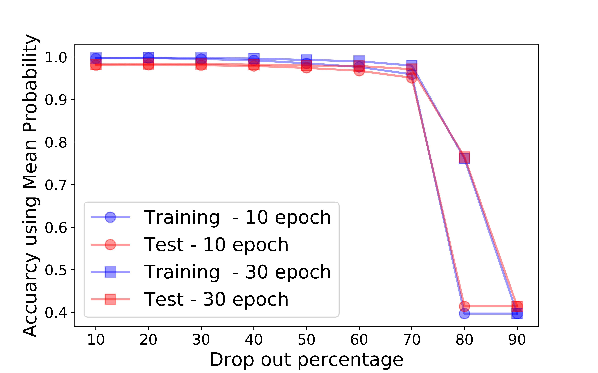

##### Grid Search For Optimal Threshold on Dropout
Left side is grid search for 381-class problem.  Right side is grid search for 5-class problem.
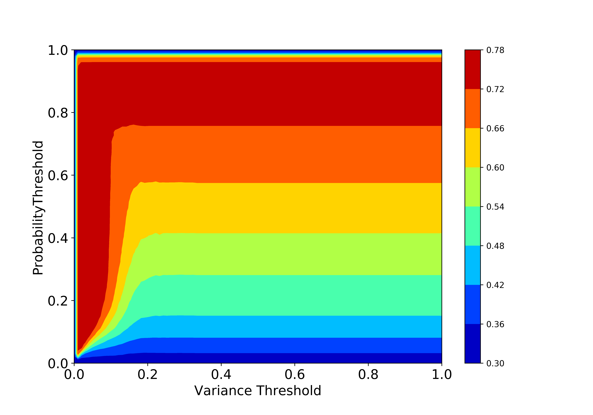  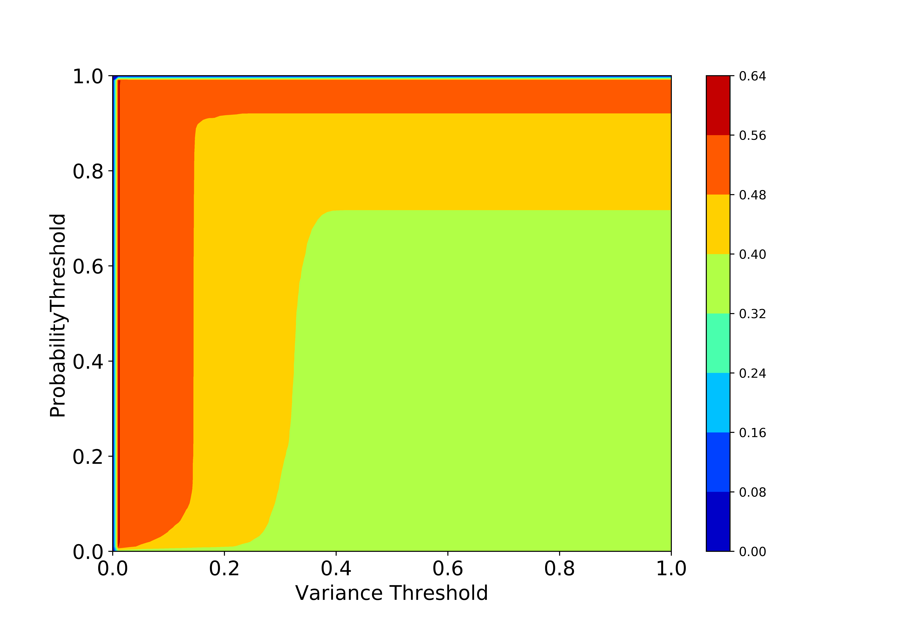

##### Optimal threshold learning on dropout 381 classes

We did more experiments using different \delta values to optimizing the thresholds from Dropout, and results can be found here.

##### Uncertainty comparison 5-class vs 381-class

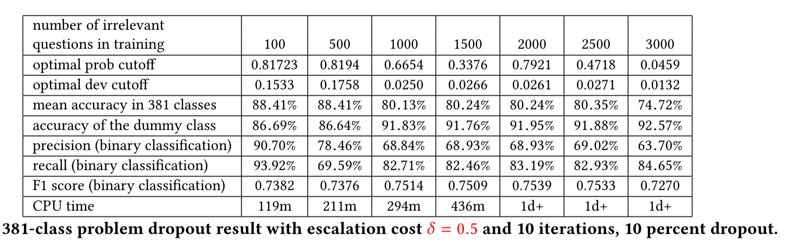
 
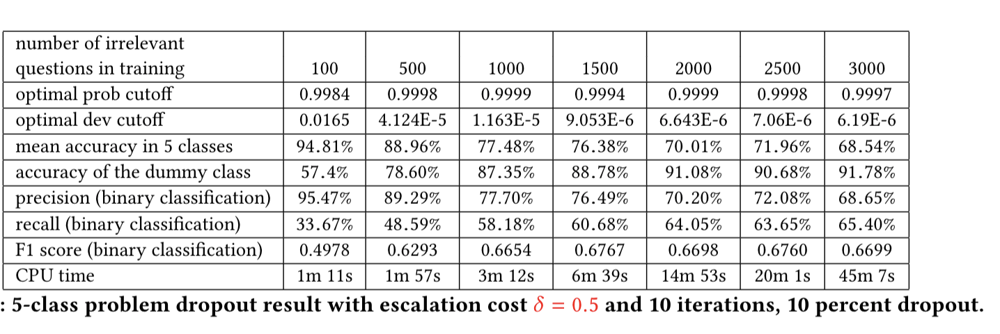

## License

Released 2020 by [Shi Yu](https://github.com/cyberyu) 
